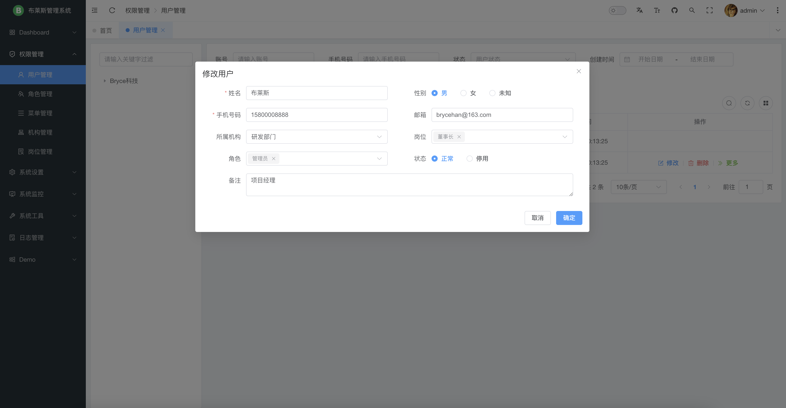
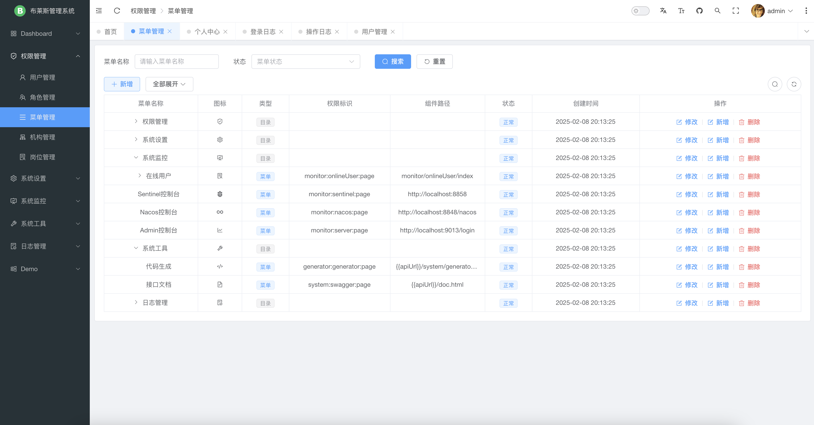
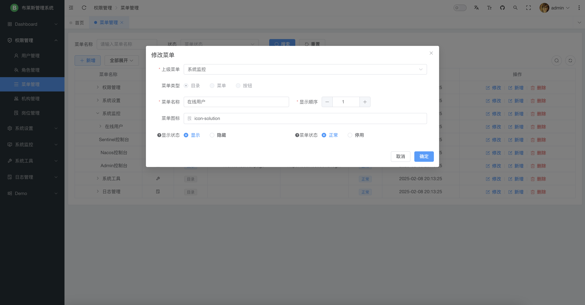
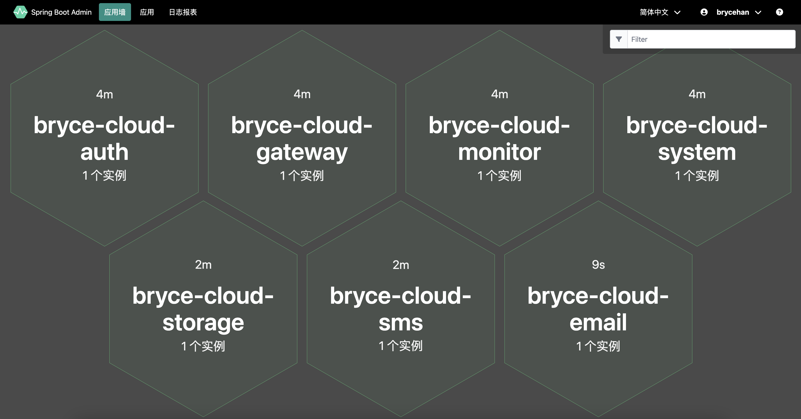
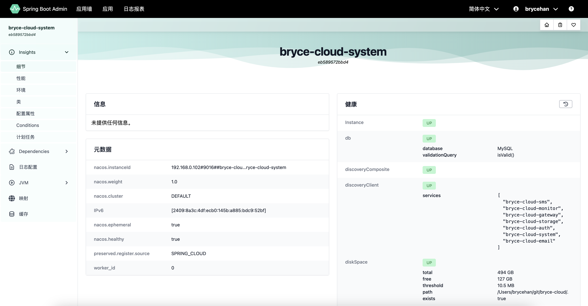
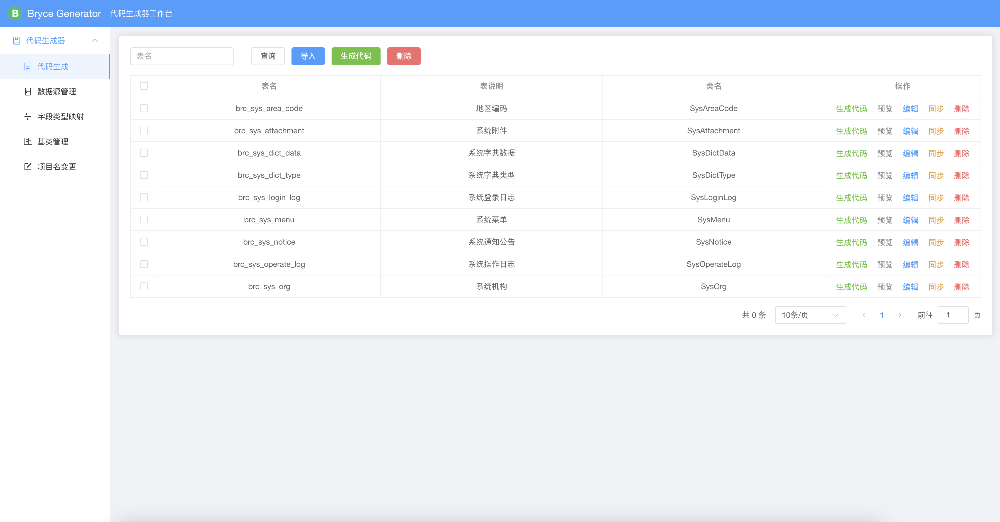
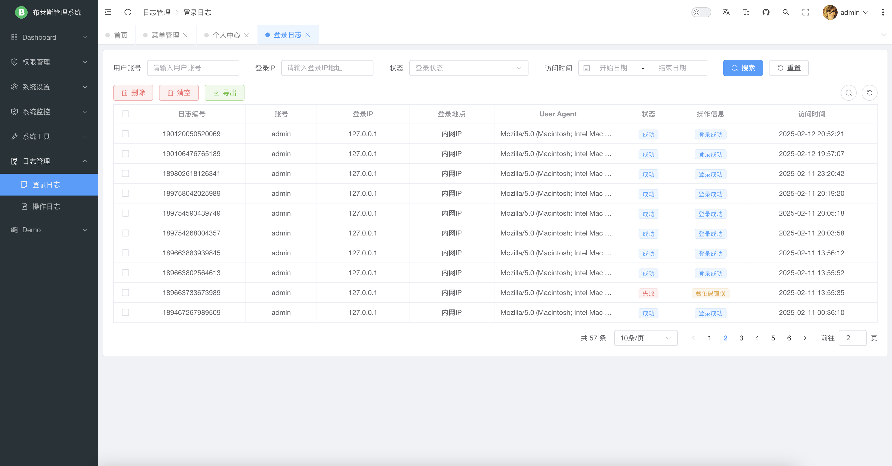
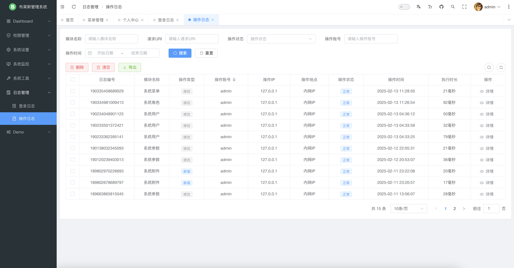

## 🔥 Bryce Admin

本项目是一个基于 Vue/Element Plus 和 Spring Boot/Spring Cloud & Alibaba 前后端分离的分布式微服务架构的前端工程。

* 前端工程：[https://github.com/brycehan/bryce-admin](https://github.com/brycehan/bryce-admin)
* 开发平台后端工程（单体版）：[https://github.com/brycehan/bryce-boot](https://github.com/brycehan/bryce-boot)
* 开发平台后端工程（微服务）：[https://github.com/brycehan/bryce-cloud](https://github.com/brycehan/bryce-cloud)
* 超好用的代码生成器：[https://github.com/brycehan/bryce-generator](https://github.com/brycehan/bryce-generator)

## 🐳 平台简介

布莱斯是一套全部开源的快速开发平台，毫无保留给个人及企业免费使用。

* 采用前后端分离的模式，前端技术栈（[Vue3](https://v3.cn.vuejs.org) [Element Plus](https://element-plus.org/zh-CN) [Vite](https://cn.vitejs.dev)）。
* 后端采用Spring Boot、Spring Cloud & Alibaba，分为单体版和微服务两个版本。
* 注册中心、配置中心选型Nacos，权限认证使用Redis。
* 流量控制框架选型Sentinel，分布式事务选型Seata。
* 如需不分微服务架构，请移步 [bryce-boot](https://github.com/brycehan/bryce-boot)。

## 📌 版本说明

| 核心库                  | 当前版本                                                                               |
|----------------------|------------------------------------------------------------------------------------|
| JDK                  |                           |
| Spring Boot          |               |
| Spring Cloud         |            |
| Spring Cloud Alibaba |  |
| Mybatis Plus         |               |
| Node.js              |                     |
| Vue.js               |                    |

## 🎨 文件结构

~~~
bryce-admin
├── docker                   // 容器模块
├── public                   // 静态资源文件（该文件夹不会被打包）
├── src                      // 源码
│       └── api                     // API接口管理
│       └── assets                  // 静态资源文件
│       └── components              // 全局组件
│       └── i18n                    // 国际化
│       └── router                  // 路由管理
│       └── stores                  // pinia 存储
│       └── utils                   // 工具库
│       └── views                   // 项目所有页面
│       └── App.vue                 // 项目主组件
│       └── main.ts                 // 项目入口文件
│       └── shims-vue.d.ts          // 指定 vue 识别 svg、scss、ts、js、mjs组件
├── .env.development         // 开发环境配置
├── .env.production          // 生产环境配置
├── .eslintignore            // 忽略 ESLint校验
├── .eslintrc.cjs            // ESLint校验配置文件
├── .gitignore               // 忽略 Git 提交
├── .gitlab-ci.yml           // GitLab CI/CD 配置
├── .prettierrc.json         // Prettier 格式化配置
├── env.d.ts                 // 声明环境变量类型
├── index.html               // 入口 html
├── package.json             // 依赖包管理
├── tsconfig-app.json        // TypeScript 全局配置，用于前端应用的编译配置
├── tsconfig.json            // TypeScript 全局配置
├── tsconfig.node.json       // TypeScript 全局配置，主要用于 Node.js 后端应用或工具脚本的编译配置
├── vite.config.ts           // Vite 全局配置
~~~

## 🔧 开发环境

Node.js 版本 v20+，下载地址：[https://nodejs.org](https://nodejs.org)

```sh
# 验证
node -v
# 配置国内源
npm config set registry https://registry.npmmirror.com
```

启动命令

```sh
cd bryce-admin
# 安装依赖
npm i
# 启动开发环境
npm run dev
# 生产打包
npm run build
```

## 🌭 内置功能

1.  用户管理：用户是系统操作者，该功能主要完成系统用户配置。
2.  部门管理：配置系统组织机构（公司、部门、小组），树结构展现支持数据权限。
3.  岗位管理：配置系统用户所属担任职务。
4.  菜单管理：配置系统菜单，操作权限，按钮权限标识等。
5.  角色管理：角色菜单权限分配、设置角色按部门进行数据范围权限划分。
6.  字典管理：对系统中经常使用的一些较为固定的数据进行维护。
7.  参数管理：对系统动态配置常用参数。
8.  通知公告：系统通知公告信息发布维护。
9.  操作日志：系统正常操作日志记录和查询；系统异常信息日志记录和查询。
10.  登录日志：系统登录日志记录查询包含登录异常。
11.  在线用户：当前系统中活跃用户状态监控。
12.  定时任务：在线（添加、修改、删除)任务调度包含执行结果日志。
13.  代码生成：前后端代码的生成（java、html、xml、sql）支持CRUD下载 。
14.  系统接口：根据业务代码自动生成相关的api接口文档。
15.  服务监控：监视当前系统CPU、内存、磁盘、堆栈等相关信息。

## 😎 演示图

|     |       |
|-----------------------------------|-------------------------------------|
|   |     |
|   |     |
|   |     |
|   |    |
|  |  |
|  |  |
|  |    |

